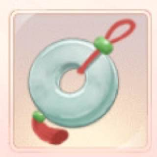
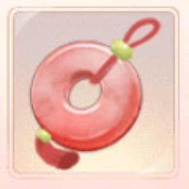
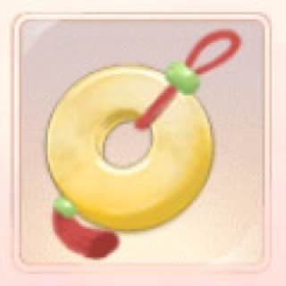

<!DOCTYPE html>

<html lang="en">
  <head>
    <meta charset="utf-8" />

    <title>Калькулятор Близости</title>
    <meta
      name="description"
      content="Легенда Феникса - Калькулятор Близости"
    />
    <meta name="author" content="Mo" />
    <link rel="preconnect" href="https://fonts.gstatic.com" />
    <link
      href="https://fonts.googleapis.com/css2?family=Pangolin&display=swap"
      rel="stylesheet"
    />
    <link
    href="https://cdn.jsdelivr.net/npm/bulma@0.9.3/css/bulma.min.css"
    rel="stylesheet"
  />
  <link
    rel="stylesheet"
    href="https://cdnjs.cloudflare.com/ajax/libs/font-awesome/6.0.0-beta2/css/all.min.css"
    integrity="sha512-YWzhKL2whUzgiheMoBFwW8CKV4qpHQAEuvilg9FAn5VJUDwKZZxkJNuGM4XkWuk94WCrrwslk8yWNGmY1EduTA=="
    crossorigin="anonymous"
    referrerpolicy="no-referrer"
  />
  <link rel="stylesheet" href="styles.css" />
  </head>
  <body>
    <nav class="navbar is-fixed-top" role="navigation" aria-label="main navigation">
      

        <a class="navbar-item" href="https://frostjk.github.io">
          Mo's LOP
        </a>
      <a role="button" class="navbar-burger" id="burger" aria-label="menu" aria-expanded="false">
        
        
        
      </a>
    

    

        

          <a class="navbar-item" href="intimacy.html">
            Калькулятор Близости
          </a>
    
          <a class="navbar-item" href="banquet.html">
            Калькулятор Банкетный Котик
          </a>

          <a class="navbar-item" href="ingots.html">
            Ingots Calculator
          </a>
    

  </nav>
    

      

        <h1 class="title center-text">Калькулятор Близости</h1>
        

          
          <input type="number" id="white" placeholder="enter quantity" />
        

        

          
          <input type="number" id="agate" placeholder="enter quantity" />
        

        
 
          
          <input type="number" id="hetian" placeholder="enter quantity" />
        

        

          
          <input type="number" id="blessing" placeholder="enter quantity" />
        

        

          
          <input type="number" id="stamina" placeholder="enter quantity" />
        

        <button onclick="calculate()">Подсчитать</button>
        <h2 id="title" class="center-text"></h2>
        

      

    

    

      Счастливый набор близости от 10 до 500 опыта, но мы не ведьмы, поэтому оцениваем 90 (пессимистично) и 150 (оптимистично). Шар физ силы полный рандом как часто даст близость, оцениваем 50 опыта. Создано гильдией mommies ру-сервера 207-210.
    

  </body>
  
  
  <!-- hitwebcounter Code START -->
  
</html>
